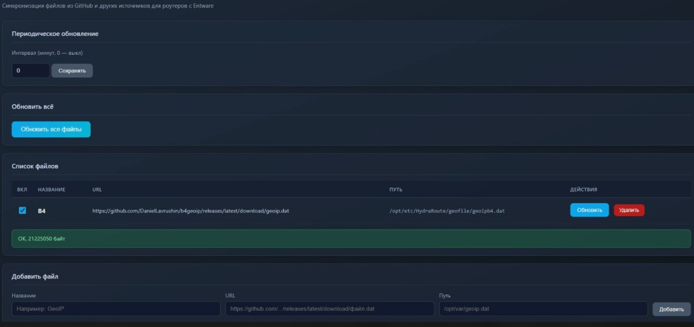
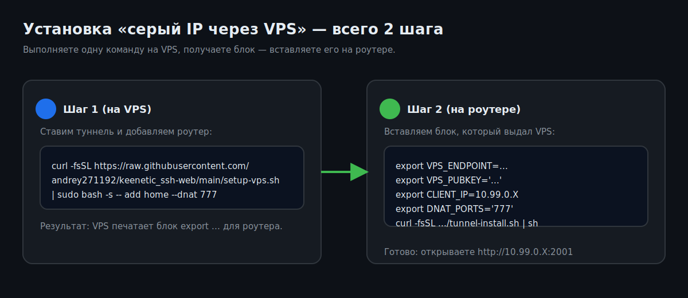

# keenetic_ssh-web

Веб‑панель, которая **выполняет команды прямо на роутере Keenetic** (Entware) и показывает вывод. Подходит для обновления пакетов, перезапусков сервисов, диагностики, и т. п.

- **Порт панели:** `2001`
- **Где работает:** на самом роутере (Entware)
- **Вход:** логин/пароль **от веб‑админки Keenetic** (NDM `/auth`)  
  (есть запасной «мастер‑пароль» `WEB_PASSWORD`, если нужно)
- **Опционально:** модуль `tunnel/` — **WireGuard‑туннель VPS ↔ роутер**, чтобы открыть доступ к панели и SSH, даже если у роутера **серый IP** (без проброса портов).




---

## Самое главное (чтобы было безопасно)

- Эта панель запускает **любые команды** в Linux на роутере. Это мощно, но опасно.
- **Не открывайте порт 2001 в интернет для всех.** Минимум — включите `ALLOWED_IPS` или используйте туннель (вариант 2).

---

## Быстрый старт (минимум команд)

## Быстрый старт (прям “для школьника”)

1) **Установи Entware** (блок ниже “📦 Установка Entware…”).
2) **Поставь панель на роутер** (вариант 1, если доступ нужен только из LAN).
3) Если роутер с серым IP и нужен доступ из любой точки — используй **туннель через VPS** (вариант 2).

Если у тебя ещё стоит **Keenetic Unified** — можно использовать этот проект отдельно, он не конфликтует: порт другой (`2001`), работает на самом роутере.

### 📦 Установка Entware на Keenetic

━━━━━━━━━━━━━━━━━━━━━━
⚠️ Определи свою архитектуру
- Mipsel — роутеры на чипе MT7628/MT7621
- Aarch64 — роутеры на чипе MT7622/MT7981/MT7988 (ARM)
━━━━━━━━━━━━━━━━━━━━━━
💡 Совет  
Начиная с KeeneticOS 4.2 Entware можно установить прямо через браузер — просто открой `192.168.1.1/a` и следуй инструкции.
━━━━━━━━━━━━━━━━━━━━━━
🚀 Установка онлайн — одной командой

🔵 Mipsel (MT7628/MT7621)
```sh
opkg disk storage:/ https://bin.entware.net/mipselsf-k3.4/installer/mipsel-installer.tar.gz
```

🟢 Aarch64 (MT7622/MT7981/MT7988)
```sh
opkg disk storage:/ https://bin.entware.net/aarch64-k3.10/installer/aarch64-installer.tar.gz
```

⏳ Дождись окончания установки — это займёт пару минут. После этого Entware готов к работе.

🔌 Подключение по SSH  
📋 Данные для входа
- Логин: `root`
- Пароль: `keenetic`
- Порт: `22` (если вы не меняли порт SSH вручную)

### Вариант 1. Панель нужна только дома (LAN)

На роутере (в Entware shell по SSH):

```sh
curl -fsSL https://raw.githubusercontent.com/andrey271192/keenetic_ssh-web/main/setup-router.sh | sh
```

Откройте в браузере:

- `http://IP_РОУТЕРА:2001`

Вход — **как в веб‑админку Keenetic**.

---

### Вариант 2. Серый IP, нужен доступ из любой точки (через VPS)

#### 2 команды “с нуля” (самый простой путь)



**Команда 1 — на VPS (Ubuntu):** поставить туннель и сразу добавить роутер.

```sh
curl -fsSL https://raw.githubusercontent.com/andrey271192/keenetic_ssh-web/main/setup-vps.sh | sudo bash -s -- add my-router
```

Где `my-router` — **имя этого роутера на VPS** (можете назвать `home`, `dacha`, `office1`).

Если у конкретного роутера «прокси/админка» сидит на другом порту (например `777`), задайте порт **для этого роутера**:

```sh
sudo kssh-tun add my-router --dnat 777
```

Что делает `--dnat`: туннель на роутере автоматически прокидывает вход на `wg0:<порт>` → `LAN_IP:<порт>`.
Это нужно, потому что некоторые сервисы Keenetic слушают **только на LAN‑IP**, и через `wg0` иначе будет `Connection refused`.

Команда на VPS выведет **готовый блок** (несколько строк `export ...` + `curl ... | sh`).

**Команда 2 — на роутере (Entware shell):** вставьте выданный блок **как есть**.

Он поднимет `wg0`, а затем установит панель на `2001`.

Проверка с VPS:

```sh
curl http://10.99.0.X:2001
ssh root@10.99.0.X
```

Можно **вообще без домена и без Caddy/Nginx**: просто открывайте панель по IP из туннеля:

- `http://10.99.0.X:2001`

Reverse‑proxy нужен только если вы хотите **красивый адрес** `https://router-домен` и HTTPS.

**Caddy (3 строки):**

```caddy
router.example.com {
  reverse_proxy 10.99.0.X:2001
}
```

**Nginx (минимальный server block):**

```nginx
server {
  server_name router.example.com;
  location / { proxy_pass http://10.99.0.X:2001; }
}
```

Рекомендация: в `.env` панели выставить **`ALLOWED_IPS=10.99.0.1`**, чтобы к роутеру мог обращаться **только VPS**.

---

### Вариант 3. Белый IP — без туннеля

Ставьте как в варианте 1 (LAN), а доступ снаружи делайте как вам удобно: проброс порта/файрвол/домен.  
Важно: **не открывайте 2001 в интернет без ограничений** (см. безопасность ниже).

---

## Как пользоваться панелью

### 1) Добавьте команду

- **Название** — как вам удобно (например: `opkg update`)
- **Команда** — обычная shell‑команда (например: `opkg update`)
- **Примечание** — необязательно

### 2) Запуск

- **Выполнить** — запускает одну команду и показывает результат
- **Выполнить все команды** — запускает все строки с галочкой **«ВКЛ»**

### 3) Расписание

- Поставьте интервал (в минутах) и нажмите **Сохранить**
- У нужных строк включите **«Распис.»**

По расписанию выполняются только строки: **ВКЛ + Распис.**

### 4) Просмотр вывода

Кнопка **«Вывод»** раскрывает полный лог последнего запуска (stdout + stderr).

---

## Примеры полезных команд (можно копировать)

- Обновить пакеты: `opkg update && opkg list-upgradable | head`
- Обновить всё: `opkg update && opkg upgrade`
- Проверить место: `df -h`
- Процессы: `top -b -n 1 | head -60`
- WireGuard: `wg show`
- Логи: `logread | tail -200`

---

## Безопасность (важно)

Это **не песочница**: команда выполняется с правами процесса (на Entware часто **root**).

- Не публикуйте порт **2001** в интернет «как есть».
- Используйте минимум: **туннель + reverse‑proxy** или **`ALLOWED_IPS`**.

---

## Удаление (одной командой)

### удаления (под ключ, без поломок)

Скрипты **удаляют только то, что сами ставили** и **не трогают**:

- HydraRoute Neo (`hrneo` / `hrweb`)
- другие Entware‑пакеты и ваши сервисы
- ваши конфиги (кроме своих файлов)
- чужие правила firewall/iptables (удаляются только наши вставки, связанные с wg0)

Если хотите сохранить настройки панели (`.env`) и список команд (`data/store.json`) — скажите, добавлю отдельную “удалить, но оставить данные” команду в `setup-router.sh` (сейчас это есть для панели через `KEEP_DATA=1`, но не вынесено в быстрый блок).

---

Панель (на роутере):

```sh
curl -fsSL https://raw.githubusercontent.com/andrey271192/keenetic_ssh-web/main/uninstall.sh | sh
```

Панель (на роутере), **сохранить команды и настройки**:

```sh
curl -fsSL https://raw.githubusercontent.com/andrey271192/keenetic_ssh-web/main/uninstall.sh | env KEEP_DATA=1 sh
```

Туннель‑клиент (на роутере, если ставили):

```sh
curl -fsSL https://raw.githubusercontent.com/andrey271192/keenetic_ssh-web/main/tunnel/tunnel-uninstall.sh | sh
```

Туннель‑сервер (на VPS, если ставили):

```sh
curl -fsSL https://raw.githubusercontent.com/andrey271192/keenetic_ssh-web/main/tunnel/server-uninstall.sh | sudo sh
```

---

## Туннель как отдельный сервис (по желанию)

Туннель — это **дополнительный сервис для всей вашей экосистемы** (keenetic‑unified, domen_hydra и т. д.). Он просто делает так, что VPS «видит» роутер по адресу `10.99.0.X`.

Полная документация (для тех, кому нужно больше деталей): `tunnel/README.md`.

---

## Частые ошибки (и решения)

### `Connection refused` через туннель (RCI/админка/порт)

Некоторые сервисы Keenetic слушают **только LAN‑IP**, и если вы ходите на `wg0`, будет `Connection refused`.

- **Решение**: включить авто‑DNAT на нужный порт:

```sh
sudo kssh-tun add my-router --dnat 81
```

или задать несколько портов: `--dnat 81,79`.

### Нельзя открывать панель в интернет

Порт `2001` — это выполнение команд. **Не публикуйте его “как есть”**.

- **Решение**: `ALLOWED_IPS` (например, только IP вашего VPS) или туннель + reverse‑proxy.

## Поддержка проекта

- **Boosty:** `https://boosty.to/andrey27/donate`
- **Ozon Bank (СБП):** `https://finance.ozon.ru/apps/sbp/ozonbankpay/019dc200-2a5d-7931-a619-782d285f6798`
- **Telegram:** `https://t.me/Iot_andrey`

Кнопка **Sponsor** на GitHub ведёт на варианты из `.github/FUNDING.yml`.
## Лицензия

MIT — см. [LICENSE](LICENSE).
