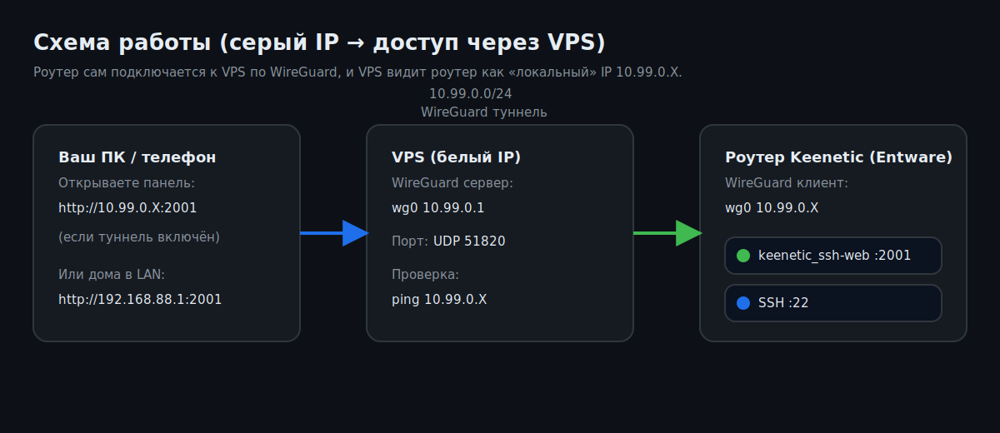

# tunnel/ — WireGuard-туннель VPS ↔ роутер

Решает задачу: у вас на роутере **серый IP** (нет публичного), но есть **VPS с белым IP**. Поднимаем WireGuard, и любой сервис на VPS обращается к роутеру по адресу из туннельной подсети (`10.99.0.X`), как если бы они были в одной LAN. SSH, HTTP, что угодно — без проброса портов и без переписывания других сервисов (`Domain Hydra`, `keenetic-unified`, `keenetic_ssh-web`, …).

## Quickstart

- На VPS выполни “1 раз” (раздел 1).
- На VPS добавь роутер (раздел 2) — команда напечатает блок `export ...`.
- Этот блок вставь на роутере (раздел 3).
  
После этого на VPS роутер будет доступен по `10.99.0.X` (SSH/HTTP/панели).

```
[VPS, белый IP]                          [Роутер, серый IP]
   :443 Caddy/Nginx  →  wg0 10.99.0.1  ⇄  wg0 10.99.0.X  →  127.0.0.1:2001 (kssh-web)
                                                            127.0.0.1:22   (SSH)
                                                            …и т. д.
```



UDP `51820`, подсеть `10.99.0.0/24`. Параметры можно поменять через ENV.

---

## 1. На VPS (Ubuntu) — один раз

```sh
curl -fsSL https://raw.githubusercontent.com/andrey271192/keenetic_ssh-web/main/tunnel/server-install.sh | sudo sh
```

Что делает:

- `apt install wireguard wireguard-tools curl`
- генерит серверные ключи (`/etc/wireguard/server_{private,public}.key`)
- создаёт `/etc/wireguard/wg0.conf` (UDP 51820, IP `10.99.0.1/24`)
- ставит утилиту `kssh-tun` в `/usr/local/bin/`
- открывает `51820/udp` в `ufw`, если он активен
- запускает `wg-quick@wg0` и ставит на автозапуск (`systemctl enable`)

В конце выводит:

```
Endpoint:    <PUBLIC_IP>:51820/udp
PublicKey:   <SERVER_PUB>
```

---

## 2. На VPS — добавление каждого роутера

```sh
sudo kssh-tun add home
```

`home` — это **имя роутера на VPS** (название peer-а). Можно любое: `dacha`, `office1`, `keenetic_andrey`.

Если у конкретного роутера сервис слушает на нестандартном порту (например `777`) и нужен авто‑DNAT `wg0:777 → LAN_IP:777`, добавьте:

```sh
sudo kssh-tun add home --dnat 777
```

Утилита:

- генерит пару ключей клиента
- выделяет следующий свободный IP в подсети (`10.99.0.2`, `10.99.0.3`, …)
- сохраняет peer-файл в `/etc/wireguard/peers/<name>.peer`
- регенерирует `wg0.conf` и применяет без рестарта (`wg syncconf`)
- **печатает готовую команду для роутера** — четыре `ENV=…` + `curl …` одной портянкой

Дополнительно:

```sh
sudo kssh-tun list                     # список peer-ов
sudo kssh-tun show router-andrey-1     # повторно вывести ENV-блок
sudo kssh-tun remove router-andrey-1   # удалить peer
sudo kssh-tun status                   # wg show wg0
```

---

## 3. На роутере (Keenetic + Entware)

### 📦 Установка Entware на Keenetic

━━━━━━━━━━━━━━━━━━━━━━
⚠️ Определи свою архитектуру
- Mipsel — роутеры на чипе MT7628/MT7621
- Aarch64 — роутеры на чипе MT7622/MT7981/MT7988 (ARM)
━━━━━━━━━━━━━━━━━━━━━━
💡 Совет  
Начиная с KeeneticOS 4.2 Entware можно установить прямо через браузер — просто открой `192.168.1.1/a` и следуй инструкции.
━━━━━━━━━━━━━━━━━━━━━━
🚀 Установка онлайн — одной командой

🔵 Mipsel (MT7628/MT7621)
```sh
opkg disk storage:/ https://bin.entware.net/mipselsf-k3.4/installer/mipsel-installer.tar.gz
```

🟢 Aarch64 (MT7622/MT7981/MT7988)
```sh
opkg disk storage:/ https://bin.entware.net/aarch64-k3.10/installer/aarch64-installer.tar.gz
```

⏳ Дождись окончания установки — это займёт пару минут. После этого Entware готов к работе.

🔌 Подключение по SSH  
📋 Данные для входа
- Логин: `root`
- Пароль: `keenetic`
- Порт: `22` (если вы не меняли порт SSH вручную)

Скопируйте блок из `kssh-tun add` и выполните на роутере (5 строк, можно блоком, можно по одной):

```sh
export VPS_ENDPOINT=212.118.42.105:51820
export VPS_PUBKEY='xxxxxxxxxxxxxxxxxxxxxxxxxxxxxxxxxxxxxxxxxxx='
export CLIENT_IP=10.99.0.5
export CLIENT_PRIVKEY='yyyyyyyyyyyyyyyyyyyyyyyyyyyyyyyyyyyyyyyyyyy='
curl -fsSL https://raw.githubusercontent.com/andrey271192/keenetic_ssh-web/main/tunnel/tunnel-install.sh | sh
```

Что делает:

- `opkg install wireguard-tools` (если ещё нет)
- пишет `/opt/etc/wireguard/wg0.conf`
- поднимает интерфейс `wg0` с адресом `CLIENT_IP/24`
- маршрутизирует `10.99.0.0/24` через `wg0`
- ставит init-скрипт `/opt/etc/init.d/S50kssh-tunnel` ({start|stop|restart|status}) и rc.d-симлинк автозапуска
- автоматически добавляет DNAT для портов из `DNAT_PORTS`: вход на `wg0:port` → `LAN_IP:port` (помогает Keenetic‑админке/HTTP Proxy открываться через туннель; удаляется uninstall‑скриптом)
- в конце пингует `10.99.0.1` (VPS) для проверки

Если ping не прошёл — почти всегда дело в фаерволе VPS: `sudo ufw allow 51820/udp` (или эквивалент для iptables/firewalld).

---

## 4. Использование туннеля

После запуска любые сервисы на VPS обращаются к роутеру по `10.99.0.X`:

```sh
# С VPS — веб-панель keenetic_ssh-web
curl http://10.99.0.5:2001/

# SSH на роутер с VPS (если у роутера включён SSH)
ssh root@10.99.0.5

# Reverse-proxy на VPS: keenetic.example.com → http://10.99.0.5:2001
# (Caddy/Nginx — прозрачно)
```

---

## Параметры (ENV)

### `server-install.sh`

| Переменная | По умолчанию | Описание |
|---|---|---|
| `WG_PORT` | `51820` | UDP-порт сервера. |
| `WG_SUBNET_PREFIX` | `10.99.0` | Первые три октета подсети `/24`. |
| `WG_SERVER_LAST_OCTET` | `1` | Последний октет адреса сервера в туннеле. |
| `KSSH_REPO` | `andrey271192/keenetic_ssh-web` | Репо, из которого ставить `kssh-tun` и `tunnel-install.sh`. |
| `KSSH_BRANCH` | `main` | Ветка. |

### `tunnel-install.sh` (на роутере)

| Переменная | Обязательная | Описание |
|---|---|---|
| `VPS_ENDPOINT` | да | `<публичный IP>:<порт>`, UDP. |
| `VPS_PUBKEY` | да | PublicKey сервера. |
| `CLIENT_IP` | да | IP роутера в туннельной подсети, например `10.99.0.5`. |
| `CLIENT_PRIVKEY` | да | PrivateKey роутера (выдаёт `kssh-tun add`). |
| `WG_IF` | `wg0` | Имя интерфейса. |
| `WG_SUBNET` | `10.99.0.1/32` | AllowedIPs клиента (что маршрутизировать в туннель). По умолчанию только VPS, чтобы не конфликтовать с существующими WG-маршрутами Keenetic. Поставьте `10.99.0.0/24` если нужно общение peer-to-peer. |
| `WG_KEEPALIVE` | `25` | `PersistentKeepalive` в секундах (нужен из-за NAT провайдера). |
| `DNAT_PORTS` | `81` | Порты через запятую, для которых делаем авто‑DNAT `wg0:port → LAN_IP:port` (исправляет `Connection refused`, когда сервис слушает только на LAN‑IP). Пример: `DNAT_PORTS=81,79`. |

---

## Безопасность

- WireGuard сам по себе шифрует трафик; но peer-файлы (`/etc/wireguard/peers/*.peer`) содержат **приватные ключи клиентов** в открытом виде — храните VPS чистым.
- Закройте `tunnel-install.sh`-команду от посторонних (там есть `CLIENT_PRIVKEY`). В Telegram/мессенджеры лучше не пересылать.
- `kssh-tun show <name>` всегда покажет ENV-блок снова — пароль не нужен, повторно сгенерировать ключ не получится. Если ключ утёк — `remove` и заново `add`.
- На стороне роутера `tunnel-install.sh` пишет конфиг в `/opt/etc/wireguard/wg0.conf` с правами `600`.

---

## Удаление

На VPS:

```sh
sudo kssh-tun remove <name>     # для каждого клиента
sudo systemctl disable --now wg-quick@wg0
sudo apt remove --purge wireguard wireguard-tools
sudo rm -rf /etc/wireguard /usr/local/bin/kssh-tun
```

На роутере:

```sh
/opt/etc/init.d/S50kssh-tunnel stop
rm -f /opt/etc/rc.d/S50kssh-tunnel /opt/etc/init.d/S50kssh-tunnel
rm -rf /opt/etc/wireguard
```

---

## Что не входит в этот туннель

- **NAT с роутера в интернет через VPS**. Здесь VPS лишь видит роутер; чтобы роутер выходил в интернет через VPS, на сервере нужен `MASQUERADE` и `ip_forward`. Не наша цель.
- **Доступ из VPS в LAN роутера** (`192.168.1.0/24`). Если нужно — расширьте `AllowedIPs` peer-а на стороне сервера и включите `ip_forward` на роутере.

В обоих случаях скажите — добавлю в установщик ENV-флаги.
